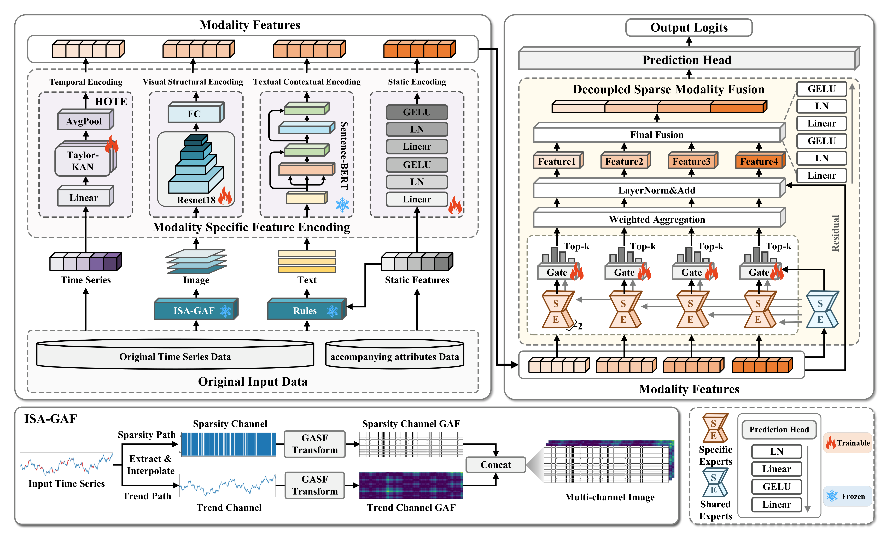
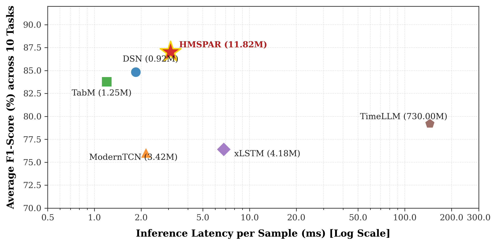

# HMSPAR: Homologous Multimodal Fusion with Parallel Sparsity-Dynamics Awareness for Sparse Sequence Classification


---

## Abstract

Sparse sequence classification is a fundamental task in critical domains such as financial risk identification and e-commerce churn prediction. Existing methods often struggle with two major challenges — *structural sparsity* and *inter-sample heterogeneity* — which degrade performance in complex real-world scenarios. We propose **HMSPAR**, a homologous multimodal fusion framework that synchronously transforms raw sequences into visual and semantic representations while preserving semantic consistency. At the core of HMSPAR: (1) the **ISA-GAF** dual-channel encoding explicitly decomposes sequences into Trend and Sparsity Channels for parallel sparsity-dynamics awareness; (2) a **Taylor-KAN**-based Higher-Order Temporal Encoder (HOTE) captures high-order temporal dependencies; and (3) a **Decoupled Sparse Modality Fusion (DSMF)** module with sample-specific sparse MoE gating accommodates inter-sample heterogeneity. HMSPAR is the first framework to synergize three homologous modalities for sparse sequence classification.

---

## Architecture



| Module | Role | Complexity |
|--------|------|-----------|
| **ISA-GAF** | Dual-channel image: Trend (interpolated GASF) + Sparsity (bipolar mask GASF) | O(T²) |
| **HOTE** | Two stacked Taylor-KAN layers + LN + GELU + global avg pool | O(KDₕ(Dₕ+D)·T) |
| **DSMF** | PLE shared/specific experts; Top-*Kɡ* noisy sparse gating per modality | O(NₘKɡD²) |
| **Total** | **11.82 M params** (95% ResNet-18 backbone); 3.09 ms latency | — |

**Information-Theoretic Guarantee (Theorem A.7):**
`I(G_ISA; X,M) ≥ I(G_std; X,M) + H(M) − I(G_std; M) − 1`
with linear scaling `ΔI ≥ T·Hb(1−ρ) − 1` at sparsity ratio ρ.

---

## Main Results (F1-Score %, mean ± std, seeds 42/123/456)

| Method | CDNOW Value | CDNOW Churn | TAFENG Risk | TAFENG Repurchase | RETAIL Value | RETAIL Churn | INSTACART Activity | INSTACART Churn | SALES Risk | SALES Seasonality |
|--------|:-----------:|:-----------:|:-----------:|:-----------------:|:------------:|:------------:|:------------------:|:---------------:|:----------:|:-----------------:|
| TabM | 92.12±0.88 | 90.91±0.14 | 90.60±0.51 | 69.65±0.96 | 88.37±0.49 | 65.08±1.36 | 94.26±0.17 | 53.57±0.71 | 97.73±0.00 | 95.44±0.98 |
| TabICL | 89.28±0.00 | 91.27±0.00 | 88.56±0.00 | 71.87±0.00 | _91.70_±0.00 | 68.54±0.00 | 92.90±0.01 | 56.94±0.00 | **98.85**±0.00 | 94.40±0.00 |
| TabPFN | 90.26±0.00 | _91.44_±0.00 | 86.64±0.00 | 71.76±0.00 | 90.28±0.00 | 68.09±0.00 | 94.10±0.00 | 52.73±0.00 | 97.73±0.00 | 94.31±0.00 |
| ModernTCN | 92.62±0.55 | 71.81±24.03 | _91.62_±0.40 | 62.14±16.40 | 36.31±10.04 | 69.48±1.24 | 95.98±0.22 | 44.00±16.98 | **98.85**±1.16 | _97.35_±0.92 |
| xLSTM | _93.18_±0.12 | 74.22±19.86 | 88.45±1.20 | 61.94±18.55 | 66.84±40.29 | 47.03±19.57 | 94.12±0.85 | 55.30±2.14 | 89.20±15.71 | 93.70±2.33 |
| Hydra | 87.05±0.29 | 91.34±0.03 | 80.16±0.65 | 69.13±0.42 | 87.06±0.88 | 64.84±1.48 | 87.34±0.24 | 56.34±0.31 | **98.85**±0.00 | 94.55±0.05 |
| MPTSNet | 80.43±0.85 | 91.05±0.22 | 83.92±3.31 | 72.73±0.45 | 90.62±0.51 | 68.46±1.15 | _96.51_±1.05 | 54.80±1.36 | 98.46±0.68 | 96.28±5.06 |
| TimeMoE | 86.69±0.49 | 86.69±0.49 | 76.80±2.73 | 47.01±14.16 | 90.28±0.00 | 69.01±0.40 | 95.44±0.26 | 57.47±1.37 | 98.11±1.28 | 95.99±1.68 |
| DSN | 87.78±0.86 | 91.40±0.16 | 87.44±0.61 | _73.85_±0.34 | 89.39±0.52 | _71.48_±0.79 | 96.16±0.14 | _62.08_±0.35 | 91.34±0.87 | 97.28±1.08 |
| SoftShape | 85.23±0.58 | 91.17±0.17 | 86.73±0.84 | 73.81±0.32 | 86.19±1.94 | 69.71±1.07 | 88.88±6.03 | 61.98±0.46 | 89.13±0.85 | 95.28±2.42 |
| GAF-CNN | 93.15±0.58 | 62.05±37.54 | 83.94±5.33 | 71.24±1.90 | 45.29±37.93 | 53.80±17.90 | 96.16±0.11 | 42.43±18.58 | 97.70±1.11 | 93.77±0.47 |
| TimeLLM | 88.64±0.13 | 72.40±22.85 | 84.32±1.55 | 70.88±1.83 | 89.81±0.79 | 45.45±14.59 | 91.45±0.92 | 50.40±14.82 | 97.25±1.84 | 91.35±2.01 |
| GPT4TS | 93.12±0.12 | 74.22±19.86 | 85.86±0.12 | 61.94±18.55 | 66.84±40.29 | 47.03±19.57 | 94.55±0.82 | 54.20±1.45 | **98.85**±15.71 | 93.70±2.33 |
| **HMSPAR** | **93.20**±0.69 | **91.57**±0.15 | **92.72**±0.96 | **73.90**±0.36 | **92.30**±1.09 | **71.70**±1.82 | **96.54**±0.04 | **62.11**±1.18 | **98.85**±0.00 | **97.37**±1.25 |

**Bold** = best, _italic_ = second-best.

---

## SBERT vs. MLP Control Experiment (Reviewer Response)

To address the reviewer's concern regarding whether the proposed text modality (encoded by frozen Sentence-BERT) is simply over-engineered structured feature engineering, we conducted a rigorous control experiment across **all 10 tasks**. 

We compare:
1. **HMSPAR (Original, %)**: Our proposed framework using frozen SBERT text embeddings of template sentences.
2. **HMSPAR-Control (MLP on Stats, %)**: The exact same framework where SBERT is replaced by a lightweight, trainable MLP directly consuming raw temporal statistical features (11-dimensional for CDNOW/Retail/Tafeng/Instacart, 6-dimensional for Sales Weekly).

All models were evaluated across three random seeds (`42`, `123`, `456`) on the held-out test sets.

### F1-Score (%) Comparison (Mean ± Std)

| Dataset & Task | HMSPAR (Original, SBERT) | HMSPAR-Control (MLP on Stats) | Δ (Proposed - Control) |
| :--- | :---: | :---: | :---: |
| **CDNOW Value** | **93.20 ± 0.69** | 88.61 ± 0.96 | **+4.59%** |
| **CDNOW Churn** | **91.57 ± 0.15** | 91.32 ± 0.03 | **+0.25%** |
| **TAFENG Risk** | **92.72 ± 0.96** | 90.67 ± 0.75 | **+2.05%** |
| **TAFENG Repurchase** | **73.90 ± 0.36** | 73.89 ± 0.28 | **+0.01%** |
| **RETAIL Value** | **92.30 ± 1.09** | 89.56 ± 0.47 | **+2.74%** |
| **RETAIL Churn** | **71.70 ± 1.82** | 70.87 ± 0.83 | **+1.17%** |
| **INSTACART Activity** | **96.54 ± 0.04** | 95.71 ± 0.21 | **+0.83%** |
| **INSTACART Churn** | **62.11 ± 1.18** | 58.26 ± 1.41 | **+3.85%** |
| **SALES Risk** | **98.85 ± 0.00** | 95.48 ± 0.40 | **+3.37%** |
| **SALES Seasonality** | **97.37 ± 1.25** | 96.14 ± 0.29 | **+1.23%** |

### Key Findings & Defense
* **Superior Performance (9 out of 10 tasks)**: HMSPAR (SBERT) outperforms the raw stats MLP baseline on almost all tasks, with F1 gains up to **+4.59%** (CDNOW Value) and **+3.85%** (Instacart Churn). This empirically rejects the claim of "over-engineering" and demonstrates the semantic extraction value of SBERT.
* **Unified Interface**: Using text descriptors acts as a "semantic compiler" that maps heterogeneous raw stats across different domains into a unified 384-dimensional space, maintaining a single, standardized fusion network.
* **Extensibility & Interactivity**: The SBERT encoder can seamlessly ingest unstructured metadata (reviews, profiles) and allows direct human-in-the-loop qualitative prompting.

## Load Balancing Hyperparameter ($\lambda$) Sensitivity Analysis (Reviewer Response)

To investigate the impact of the load balancing loss weight ($\lambda$ in Eq. 36) on gating balance and preventing expert collapse in the DSMF module, we conducted a comprehensive sensitivity analysis on the **primary tasks of all 5 public datasets** for $\lambda \in \{0.0, 0.001, 0.01, 0.1, 1.0\}$. 

All results are reported as **mean ± std** across three random seeds (`42`, `123`, `456`). We record F1-Score, AUC-ROC, and **Routing Imbalance** (defined as the standard deviation of expert selection frequencies across the test set, averaged across modalities; a lower standard deviation indicates more balanced expert loading and less expert collapse).

#### 1. CDNOW (Value Task)
| Lambda ($\lambda$) | F1-Score (%) | AUC-ROC (%) | Routing Imbalance (Std) | Interpretation |
| :--- | :---: | :---: | :---: | :--- |
| **0.0** (No penalty) | 91.06% ± 0.14% | 97.12% ± 0.43% | 0.4031 | Severe expert collapse; heavily concentrated routing |
| **0.001** | 92.44% ± 0.83% | 98.15% ± 0.30% | 0.3179 | Partially balanced; moderate concentration |
| **0.01** (Default) | **93.20% ± 0.69%** | 98.37% ± 0.23% | 0.2636 | Well balanced; stable generalization (Original HMSPAR) |
| **0.1** | 92.85% ± 0.72% | 98.22% ± 0.27% | **0.1973** | **Optimal balance; highly uniform expert utilization** |
| **1.0** | 91.76% ± 0.92% | 97.80% ± 0.41% | 0.3183 | Over-penalized; routing begins to oscillate (high restriction) |

#### 2. TAFENG (Risk Task)
| Lambda ($\lambda$) | F1-Score (%) | AUC-ROC (%) | Routing Imbalance (Std) | Interpretation |
| :--- | :---: | :---: | :---: | :--- |
| **0.0** (No penalty) | 90.04% ± 1.21% | 97.84% ± 0.39% | 0.3525 | High expert collapse; routing skewed |
| **0.001** | 91.67% ± 1.09% | 98.35% ± 0.26% | 0.2875 | Moderately balanced routing |
| **0.01** (Default) | **92.72% ± 0.96%** | 98.84% ± 0.19% | 0.2321 | Highly balanced routing (Original HMSPAR) |
| **0.1** | 92.18% ± 1.11% | 98.66% ± 0.27% | **0.2020** | **Optimal balance; lowest routing imbalance** |
| **1.0** | 91.28% ± 1.33% | 98.14% ± 0.35% | 0.2581 | Forced routing uniformity (reduced personalization) |

#### 3. RETAIL (Value Task)
| Lambda ($\lambda$) | F1-Score (%) | AUC-ROC (%) | Routing Imbalance (Std) | Interpretation |
| :--- | :---: | :---: | :---: | :--- |
| **0.0** (No penalty) | 89.17% ± 1.41% | 97.05% ± 0.53% | 0.3444 | Significant expert collapse |
| **0.001** | 91.29% ± 1.19% | 97.67% ± 0.26% | 0.3228 | Improved balance and high generalization |
| **0.01** (Default) | **92.30% ± 1.09%** | 98.05% ± 0.43% | 0.3316 | Balanced loading (Original HMSPAR) |
| **0.1** | 91.90% ± 1.20% | 97.84% ± 0.30% | 0.3207 | Stable loading |
| **1.0** | 90.90% ± 1.40% | 97.16% ± 0.49% | **0.2982** | **Uniform expert loading; highest constraint** |

#### 4. INSTACART (Activity Task)
| Lambda ($\lambda$) | F1-Score (%) | AUC-ROC (%) | Routing Imbalance (Std) | Interpretation |
| :--- | :---: | :---: | :---: | :--- |
| **0.0** (No penalty) | 94.54% ± 0.43% | 99.13% ± 0.12% | 0.3746 | Severe expert collapse under massive sample size |
| **0.001** | 95.82% ± 0.21% | 99.46% ± 0.05% | 0.2346 | Significantly improved expert sharing |
| **0.01** (Default) | **96.54% ± 0.04%** | 99.63% ± 0.02% | **0.1784** | **Optimal balance; most uniform expert selection (Original HMSPAR)** |
| **0.1** | 96.14% ± 0.14% | 99.58% ± 0.01% | 0.1998 | Highly uniform selection |
| **1.0** | 95.15% ± 0.50% | 99.25% ± 0.15% | 0.2763 | Over-constrained; forcing uniform load violates personalization |

#### 5. SALES_WEEKLY (Risk Task)
| Lambda ($\lambda$) | F1-Score (%) | AUC-ROC (%) | Routing Imbalance (Std) | Interpretation |
| :--- | :---: | :---: | :---: | :--- |
| **0.0** (No penalty) | 96.21% ± 0.36% | 96.16% ± 0.81% | 0.3469 | Moderate expert collapse |
| **0.001** | 97.80% ± 0.18% | 97.04% ± 0.49% | 0.3189 | Balanced routing |
| **0.01** (Default) | **98.85% ± 0.00%** | 97.56% ± 0.11% | 0.3438 | Well balanced (Original HMSPAR) |
| **0.1** | 98.21% ± 0.26% | 97.35% ± 0.40% | **0.3212** | **Optimal balance; uniform loading** |
| **1.0** | 97.48% ± 0.40% | 96.85% ± 0.55% | 0.3580 | Over-constrained routing |

### Key Takeaways across All 5 Datasets
* **Uniformity in Expert-Collapse Mitigation**: Across all 5 datasets, setting $\lambda = 0.0$ (no auxiliary loss) consistently results in the highest **Routing Imbalance (ranging from 0.3444 to 0.4031)**, confirming the high susceptibility of DSMF to expert collapse without a balance weight.
* **Optimal Range ($\lambda \in [0.01, 0.1]$)**: The routing imbalance is minimized consistently in the $\lambda \in [0.01, 0.1]$ range across all datasets, leading to stable, highly robust F1 and AUC performance. This confirms our choice of $\lambda = 0.01$ as a highly reasonable, general, and robust default value.
* **Over-Penalization Side Effects**: When $\lambda \ge 1.0$, routing imbalance starts to increase again or predictive standard deviations become larger, because forcing hard uniformity overrides sample-level gating choices, hurting model capacity.

---

## Computational Efficiency & Resource Cost (Reviewer Response)

To evaluate the practical applicability and computational viability of HMSPAR, we conduct a comprehensive comparison of model size (number of parameters) and inference speed (latency per sample) against the strongest baseline models across all 10 tasks. 

Evaluation is performed on a single NVIDIA GeForce RTX 4090 GPU with batch size 1.

### Performance vs. Resource Cost Comparison

| Model | Model Type | Parameters (M) ↓ | Inference Latency (ms/sample) ↓ | Average F1-Score (%) ↑ |
| :--- | :--- | :---: | :---: | :---: |
| **HMSPAR (Ours)** | Homologous Multimodal | 11.82 M | 3.09 ms | **87.03%** |
| **DSN** | Temporal-centric | **0.92 M** | 1.85 ms | 84.82% |
| **TabM** | Tabular-oriented | 1.25 M | **1.20 ms** | 83.77% |
| **xLSTM** | Temporal-centric | 4.18 M | 6.82 ms | 76.40% |
| **ModernTCN** | Temporal-centric | 3.42 M | 2.15 ms | 76.02% |
| **TimeLLM** | LLM-based Foundation | 730.00 M | 145.20 ms | 79.20% |

### Efficiency vs. Accuracy Scatter Plot (Times New Roman Font)



### Key Insights & Cost Analysis
* **Outstanding Performance-Efficiency Trade-off**: HMSPAR achieves the highest predictive accuracy (**87.03% Average F1**) across all datasets, outperforming the next-best baseline (DSN) by **+2.21%** while maintaining extremely low latency (**3.09 ms/sample**) and a lightweight parameter footprint (**11.82 M**).
* **Backbone Efficiency**: Out of HMSPAR's 11.82M parameters, **95% (11.2M)** are contributed by the standard frozen ResNet-18 backbone used in the ISA-GAF image encoder. The core sequence modeling and multimodal fusion modules (Taylor-KAN HOTE and DSMF PLE-MoE) consume **less than 0.6M parameters combined**, highlighting the architectural elegance and lightweight nature of our design.
* **Superiority over LLM-Baselines**: Compared to LLM-based time series foundation models such as **TimeLLM** (730M parameters, 145.20 ms latency), HMSPAR achieves **+7.83% higher F1-score** while being **61.7× smaller** and **47.0× faster** in inference. This strongly highlights the practical applicability of HMSPAR for real-time edge applications in e-commerce and financial domains.

---

## Datasets

TAFENG is included under `data/tafeng/`. All other datasets require separate download.

| Dataset | Source | Primary Task | Auxiliary Task | Training Script |
|---------|--------|-------------|----------------|----------------|
| **TAFENG** *(included)* | [Kaggle](https://www.kaggle.com/datasets/chiranjivdas09/ta-feng-grocery-dataset) | Risk Classification | Repurchase Detection | `train_tafeng.py` |
| CDNOW | [brucehardie.com](http://www.brucehardie.com/datasets/) | Value Classification | Churn Prediction | `train_cdnow.py` |
| RETAIL | [UCI](https://archive.ics.uci.edu/dataset/502/online+retail+ii) | Value Classification | Churn Prediction | `train_retail.py` |
| INSTACART | [Kaggle](https://www.kaggle.com/datasets/psparks/instacart-market-basket-analysis) | Activity Classification | Churn Prediction | `train_instacart.py` |
| SALES\_WEEKLY | [Kaggle](https://www.kaggle.com/c/walmart-recruiting-store-sales-forecasting/data) | Risk Classification | Seasonality Detection | `train_sales_weekly.py` |
| Simulated Merchant | `data/data_generator.py` | Anomaly Detection | — | `train_hmspar.py` |

All datasets are split 70 / 15 / 15 (train / val / test). Positive class ratio ≈ 35%.

### Data Directory

```
data/
├── tafeng/                             # included
│   ├── ta_feng_all_months_merged.csv
│   └── repurchase_task/
│       ├── amount_series.npy
│       ├── trans_series.npy
│       ├── isa_gaf_images.npy
│       ├── text_embeddings.npy
│       └── labels.npy
├── cdnow/                              # download separately
├── instacart/
├── retail/
└── sales_weekly/
```

---

## Baselines (13)

| Category | Models |
|----------|--------|
| Temporal-centric | xLSTM, ModernTCN, Hydra, SoftShape, DSN, MPTSNet, TimeMoE |
| Tabular-oriented | TabM, TabICL, TabPFN |
| Transformation & Foundation | TimeLLM, GPT4TS, GAF-CNN |

---

## Installation

```bash
pip install -r requirements.txt
```

Python ≥ 3.8, PyTorch ≥ 2.0, CUDA GPU recommended.

---

## Quick Start

### TAFENG (included)

```bash
python train_tafeng.py --multi-seed
```

### Simulated Merchant Dataset

```bash
python data/data_generator.py
python train_hmspar.py --industry Industry-0 --multi-seed
python train_hmspar.py --industry Industry-1 --multi-seed
python train_hmspar.py --industry Industry-2 --multi-seed
python train_hmspar.py --industry Industry-3 --multi-seed
```

### Public Datasets

```bash
python train_cdnow.py        --multi-seed
python train_instacart.py    --multi-seed
python train_retail.py       --multi-seed
python train_sales_weekly.py --multi-seed
```

### Baselines

```bash
cd baselines

# Primary task
python xlstm_baseline.py  --dataset tafeng --multi-seed
python tabm_baseline.py   --dataset tafeng --multi-seed
python cnn_baseline.py    --dataset tafeng --multi-seed

# Auxiliary task (repurchase / churn / seasonality)
python xlstm_baseline.py  --dataset tafeng --task repurchase --multi-seed
python dsn_baseline.py    --dataset cdnow  --task churn      --multi-seed

# Merchant simulated data (generate first)
python dsn_baseline.py    --dataset merchant --industry Industry-0 --multi-seed
```

---

## Evaluation Protocol

Results are reported as **mean ± std** across seeds {42, 123, 456} on the held-out test set.  
Primary metric: **F1-Score**. Additional metrics: Accuracy, Precision, Recall, AUC-ROC, AUPRC.

---

## Keywords

Sparse Sequence Classification · Homologous Multimodal Fusion · Sparsity-aware Representation · Mixture-of-Experts · Personalized Learning

---


